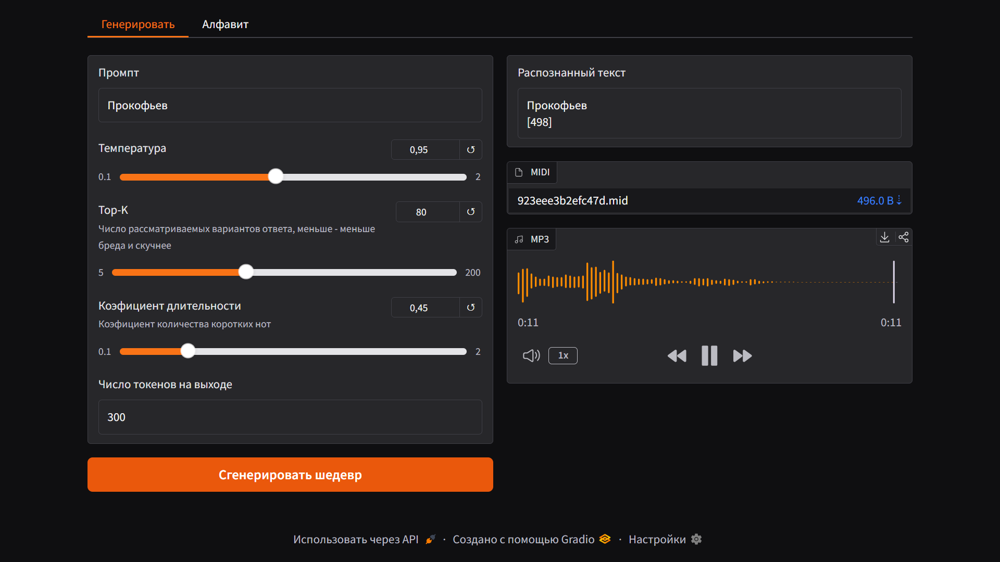

# 🎹 MusicNetwork v1.0: AI Solo Piano Generator

**MusicNetwork** — это нейросетевая модель для генерации сольных партий на фортепиано на основе текстовых промптов. Проект представляет собой полноценный конвейер: от обработки сырых MIDI-данных до финального рендеринга аудио с наложением эффектов.

> **Статус:** Версия v1.0 (Piano Solo). Текущая архитектура базируется на связке Linear Encoder + LSTM Decoder.

---

## 🚀 Основные возможности

*   **Text-to-MIDI**: Генерация музыки по текстовому описанию (например, "Jazz piano with fast rhythm").
*   **MIDI токенизация**: Использование стандарта **REMI** (через `miditok`) для токенизации.
*   **Автоматический синтез**: Интеграция с **FluidSynth** для мгновенного преобразования MIDI в высококачественное аудио (MP3).
*   **Post-processing**: Автоматическое наложение эффекта реверберации (Reverb) через библиотеку `pedalboard` для придания "объема" звучанию.
*   **Интерактивный UI**: Полноценный веб-интерфейс на **Gradio** с настройками генерации.

**🖼️ Изображение Gradio интерфейса**



**🔊 Пример генерации**
<br>**Промпт: "Бах"**
[data/git/prokofiev.mp3](https://github.com/treketerer/MusicNetwork/blob/main/data/git/Bach.mp3)
<br>**Промпт: "Прокофьев"**
[data/git/Bach.mp3](https://github.com/treketerer/MusicNetwork/blob/main/data/git/prokofiev.mp3)

---


## 🧠 Архитектура модели

Модель построена по иерархическому принципу:

1.  **Encoder (Linear)**: Превращает текстовый промпт в компактное векторное представление, которое служит "настроением" для всей будущей композиции.
2.  **Decoder (LSTM)**: 
    *   3-слойная LSTM-сеть.
    *   Принимает на вход контекст энкодера и последовательность MIDI-токенов.
    *   Генерирует музыку пошагово, предсказывая вероятности следующей ноты, паузы или изменения громкости.

---

## 🛠 Технологический стек

*   **Язык**: Python 3.10+
*   **Deep Learning**: PyTorch
*   **Обработка музыки**: `miditok`, `symusic`
*   **Аудио-движок**: FluidSynth, `midi2audio`, `pedalboard`
*   **Интерфейс**: Gradio
---

## 📦 Установка и запуск

### 1. Системные зависимости
Для генерации звука необходимо установить **FluidSynth**:
*   **Windows**: Скачать [бинарные файлы](https://www.fluidsynth.org/) и добавить путь к ним в системную переменную `PATH`.
*   **Linux**: `sudo apt-get install fluidsynth`

### 2. Установка библиотек Python
В releases лежит portable версия проекта с уже приложенным venv и библиотеками.
Установку проекта можно произвести через запуск **install.bat** файла в корне проекта или же через
<br>```".venv\Scripts\python.exe" -m pip install -r "requirements.txt"```
<br>или же
<br>```pip install -r "requirements.txt"```

Запуск проекта производится через **start.bat** или вручную:
<br>```".venv\Scripts\python.exe" -m main.py```
<br>или же
<br>```python main.py```


---

### 📈 Обучение
Модель была обучена на больших объемах данных через IterableDataset. Обучалась на 220+ тысячах midi файлов из [MAESTRO MIDI dataset]("https://magenta.tensorflow.org/datasets/maestro").
* **Loss Function**: CrossEntropyLoss.
* **Optimizer**: Adam (LR: 0.0005).
* **Batch Size**: 192.
* **Clipping**: Нормализация градиентов (max_norm=1.0) для стабильности LSTM.
* **Final Loss**: на финальной версии модели Loss достиг 1.4. Дальше обучение очень сильно замедлилось.

Логи и чекпоинты сохраняются автоматически после каждой эпохи в папку ./models/.

### 🏗 План развития (v2.0)
В данный момент ведется работа над переходом к иерархической мульти-инструментальной архитектуре:
* Conductor-Follower Architecture: Отдельная "дирижирующая" нейросеть для контроля структуры тактов.
* Multi-track: Генерация партий для различных инструментов одновременно.
