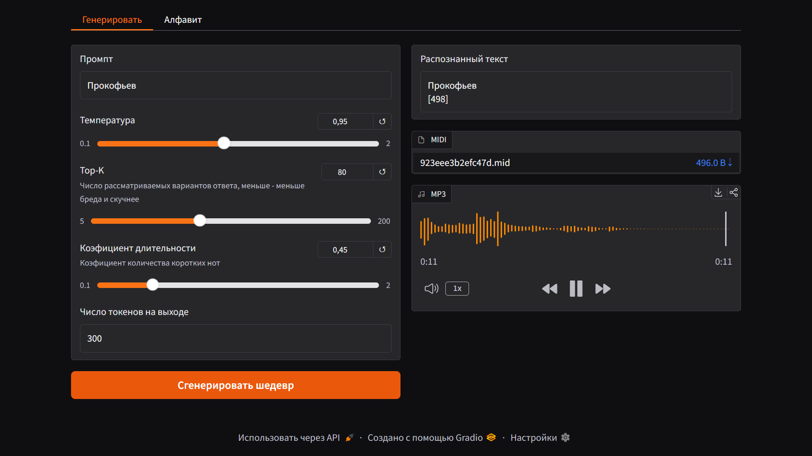

# 🎹 MusicNetwork v1.5: Multi-Instruments Generator


> **Cтабильная версия 1.0 сеть-пианист доступна в [releases](https://github.com/treketerer/MusicNetwork/releases/tag/Piano_v1.0)**

## ⚠️ Статус версии v1.5 (Experimental)
Текущая ветка **main** содержит экспериментальную мульти-инструментальную архитектуру.
**Результаты обучения на текущем этапе признаны неудовлетворительными:** модель генерирует музыку низкого качества, хотя общую суть музыки уловила. Вероятная причина — ограничения датасета Godzilla для многодорожечных партий.

---

**MusicNetwork** — это нейросетевая модель для генерации MIDI музыки на основе текстовых промптов. Проект представляет собой полноценный конвейер: от обработки сырых MIDI-данных до финального рендеринга аудио с наложением эффектов.

---

## 🚀 Основные возможности

*   **Text-to-MIDI**: Генерация музыки по текстовому описанию (например, "Jazz piano with fast rhythm").
*   **MIDI токенизация**: Использование стандарта **REMI** (через `miditok`) для токенизации.
*   **Автоматический синтез**: Интеграция с **FluidSynth** для мгновенного преобразования MIDI в высококачественное аудио (MP3).
*   **Post-processing**: Автоматическое наложение эффекта реверберации (Reverb) через библиотеку `pedalboard` для придания "объема" звучанию.
*   **Интерактивный UI**: Полноценный веб-интерфейс на **Gradio** с настройками генерации.

---

**🖼️ Изображение Gradio интерфейса**


---

## 🧠 Архитектура модели

Модель построена по иерархическому принципу:

1.  **Encoder (Linear)**: Превращает текстовый промпт в компактное векторное представление, которое служит "настроением" для всей будущей композиции.
2.  **LSTM Conductor**: 
    *   2-слойная LSTM-сеть.
    *   Принимает на вход конкатенированные векторы текста, инструментов пести, а также Backloop вектор прошлых тактов, если есть.
    *   Генерирует настроение для предстоящего такта.
3.  **Instruments LSTM**: 
    *   2-слойная LSTM-сеть.
    *   Принимает на вход конкатенированные векторы настроения такта от LSTM дирижера + вектор инструментов.
    *   Генерирует музыку пошагово каждым инструментов, предсказывая вероятности следующей ноты, паузы или изменения громкости.

---

## 🛠 Технологический стек

*   **Язык**: Python 3.10+
*   **Deep Learning**: PyTorch
*   **Обработка музыки**: `miditok`, `symusic`
*   **Аудио-движок**: FluidSynth, `midi2audio`, `pedalboard`
*   **Интерфейс**: Gradio
---

## 📦 Установка и запуск

### 1. Системные зависимости
Для генерации звука необходимо установить **FluidSynth**:
*   **Windows**: Скачать [бинарные файлы](https://www.fluidsynth.org/) и добавить путь к ним в системную переменную `PATH`.
*   **Linux**: `sudo apt-get install fluidsynth`

### 2. Установка библиотек Python
В releases лежит portable версия проекта с уже приложенным venv и библиотеками.
Установку проекта можно произвести через запуск **install.bat** файла в корне проекта или же через
<br>```".venv\Scripts\python.exe" -m pip install -r "requirements.txt"```
<br>или же
<br>```pip install -r "requirements.txt"```

Запуск проекта производится через **start.bat** или вручную:
<br>```".venv\Scripts\python.exe" -m main.py```
<br>или же
<br>```python main.py```

---

### 📈 Обучение
Модель была обучена на больших объемах данных через IterableDataset. Обучалась на 220+ тысячах midi файлов из [Godzilla-Piano MIDI Dataset](https://huggingface.co/datasets/projectlosangeles/Godzilla-MIDI-Dataset).
* **Loss Function**: CrossEntropyLoss.
* **Optimizer**: Adam (LR: 0.0005).
* **Batch Size**: 64 (Накопление градиента в угоду GPU памяти).
* **Clipping**: Нормализация градиентов (max_norm=1.0) для стабильности LSTM.
* **Final Loss**: на финальной версии модели Loss достиг 1.3, но был очень нестабильным. Итоговый Loss явно не отражал итоговое качество, поэтому проект будет дальше переделываться
Логи и чекпоинты сохраняются автоматически после каждой эпохи в папку ./models/.

### 🏗 План развития (v2.0)
В данный момент далее ведется работа над переходом к иерархической мульти-инструментальной архитектуре:
* Переезд на другой Dataset (GigaMIDI)
* Conductor-Follower Architecture: Отдельная "дирижирующая" нейросеть для контроля структуры тактов.
* Multi-track: Генерация партий для различных инструментов одновременно.
